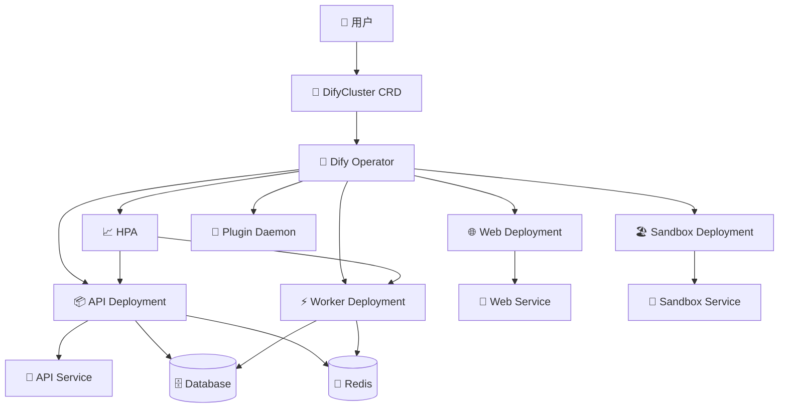

# Dify Operator

🚀 基于 Kubernetes Operator 模式的 Dify 集群管理工具

## 概述

Dify Operator 是一个 Kubernetes Operator，通过自定义资源 `DifyCluster` 实现 Dify 应用的声明式配置和自动化管理。它将复杂的 Dify 部署简化为一个简单的 YAML 配置文件。

## 特性

✅ **声明式配置**：通过 `DifyCluster` CRD 简化配置管理  
✅ **自动化管理**：智能的组件生命周期管理  
✅ **智能扩缩容**：基于 CPU/内存的自动扩缩容  
✅ **版本管理**：一键版本升级和回滚  
✅ **故障自愈**：自动检测和恢复故障组件  
✅ **多存储支持**：本地存储、S3、GCS 等  
✅ **灵活网络**：Ingress、LoadBalancer 等网络配置  
✅ **配置迁移**：从传统 Helm 平滑迁移  

## 架构图



## 快速开始

### 安装 Operator

```bash
# 使用 Helm 安装
helm install dify-operator charts/dify-operator \
  --namespace dify-operator-system \
  --create-namespace
```

### 部署 Dify 集群

```yaml
apiVersion: dify.ai/v1alpha1
kind: DifyCluster
metadata:
  name: dify-prod
  namespace: dify-system
spec:
  difyVersion: "1.7.1"
  components:
    api:
      enabled: true
      replicas: 2
      autoscaling:
        enabled: true
        minReplicas: 1
        maxReplicas: 10
    worker:
      enabled: true
      replicas: 3
    web:
      enabled: true
      replicas: 2
  storage:
    type: "local"
  database:
    postgresql:
      enabled: true
      database: "dify"
```

```bash
kubectl apply -f dify-cluster.yaml
```

## 项目结构

```
dify-operator/
├── api/v1alpha1/           # CRD 定义
│   ├── difycruster_types.go
│   └── groupversion_info.go
├── controllers/            # Operator 控制器
│   └── difycruster_controller.go
├── config/                 # Kubernetes 配置
│   ├── crd/bases/         # CRD 配置
│   └── rbac/              # RBAC 配置
├── scripts/               # 工具脚本
│   ├── migrate-config.py  # 配置迁移工具
│   └── e2e-test.sh       # 端到端测试
├── charts/dify-operator/  # Helm Chart
├── Dockerfile             # 容器构建
├── Makefile              # 构建脚本
└── README.md             # 项目文档
```

## 开发指南

### 环境准备

```bash
# 安装依赖
go mod download

# 生成代码
make generate

# 生成 CRD
make manifests
```

### 本地开发

```bash
# 安装 CRD 到集群
make install

# 本地运行 Operator
make run

# 构建镜像
make docker-build

# 部署到集群
make deploy
```

### 测试

```bash
# 运行单元测试
make test

# 运行端到端测试
make e2e-test

# 运行配置迁移测试
make migrate-config
```

## 配置参考

### DifyCluster 完整配置示例

```yaml
apiVersion: dify.ai/v1alpha1
kind: DifyCluster
metadata:
  name: dify-prod
  namespace: dify-system
spec:
  # Dify 版本
  difyVersion: "1.7.1"
  
  # 组件配置
  components:
    # API 组件
    api:
      enabled: true
      replicas: 3
      autoscaling:
        enabled: true
        minReplicas: 2
        maxReplicas: 20
        targetCPUUtilization: 70
        targetMemoryUtilization: 80
      resources:
        requests:
          cpu: "500m"
          memory: "1Gi"
        limits:
          cpu: "2000m"
          memory: "4Gi"
    
    # Worker 组件
    worker:
      enabled: true
      replicas: 5
      autoscaling:
        enabled: true
        minReplicas: 3
        maxReplicas: 50
        targetCPUUtilization: 60
      resources:
        requests:
          cpu: "300m"
          memory: "512Mi"
        limits:
          cpu: "1000m"
          memory: "2Gi"
    
    # Web 组件
    web:
      enabled: true
      replicas: 2
      resources:
        requests:
          cpu: "100m"
          memory: "256Mi"
        limits:
          cpu: "500m"
          memory: "1Gi"
    
    # Sandbox 组件
    sandbox:
      enabled: true
      replicas: 1
      autoscaling:
        enabled: true
        minReplicas: 1
        maxReplicas: 5
      resources:
        requests:
          cpu: "250m"
          memory: "512Mi"
        limits:
          cpu: "1000m"
          memory: "2Gi"
    
    # Plugin Daemon 组件
    pluginDaemon:
      enabled: true
      replicas: 1
      resources:
        requests:
          cpu: "100m"
          memory: "256Mi"
        limits:
          cpu: "500m"
          memory: "1Gi"
  
  # 存储配置
  storage:
    type: "s3"  # local, s3, gcs
    s3:
      endpoint: "https://s3.amazonaws.com"
      bucket: "dify-storage"
      accessKey: "your-access-key"
      secretKey: "your-secret-key"
      region: "us-east-1"
  
  # 数据库配置
  database:
    postgresql:
      enabled: true
      host: "postgres.example.com"
      database: "dify"
      username: "dify"
      password: "your-password"
    redis:
      enabled: true
      host: "redis.example.com"
      password: "your-password"
  
  # 网络配置
  networking:
    service:
      type: "LoadBalancer"
    ingress:
      enabled: true
      host: "dify.example.com"
      tls: true
```

## 运维操作

### 查看集群状态

```bash
# 查看 DifyCluster 状态
kubectl get difycruster -o wide

# 查看详细信息
kubectl describe difycruster dify-prod

# 查看组件状态
kubectl get pods -l app.kubernetes.io/name=dify
```

### 扩缩容操作

```bash
# 手动扩容
kubectl patch difycruster dify-prod --type='merge' \
  -p='{"spec":{"components":{"api":{"replicas":5}}}}'

# 更新自动扩缩容配置
kubectl patch difycruster dify-prod --type='merge' \
  -p='{"spec":{"components":{"api":{"autoscaling":{"maxReplicas":20}}}}}'
```

### 版本升级

```bash
# 升级版本
kubectl patch difycruster dify-prod --type='merge' \
  -p='{"spec":{"difyVersion":"1.8.0"}}'

# 查看升级进度
kubectl get difycruster dify-prod -w
```

## 故障排查

### 查看日志

```bash
# Operator 日志
kubectl logs -n dify-operator-system \
  deployment/dify-operator-controller-manager -f

# 组件日志
kubectl logs deployment/dify-prod-api -f
kubectl logs deployment/dify-prod-worker -f
```

### 常见问题

1. **组件无法启动**
   - 检查资源配置是否充足
   - 验证镜像拉取是否正常
   - 查看依赖服务是否就绪

2. **自动扩缩容不工作**
   - 确认 Metrics Server 已安装
   - 检查资源配置是否设置
   - 验证 HPA 配置是否正确

3. **数据库连接失败**
   - 检查数据库配置是否正确
   - 验证网络连通性
   - 确认认证信息是否有效

## 贡献指南

欢迎提交 Issue 和 Pull Request！

### 开发流程

1. Fork 项目
2. 创建特性分支
3. 提交更改
4. 添加测试
5. 提交 PR

### 代码规范

- 遵循 Go 语言规范
- 添加必要的注释
- 保持测试覆盖率
- 更新相关文档

## 许可证

本项目采用 [Apache License 2.0](LICENSE) 许可证。

## 支持

- **文档**: [完整文档](../README-operator.md)
- **GitHub Issues**: [提交问题](https://github.com/langgenius/dify-operator/issues)
- **讨论**: [GitHub Discussions](https://github.com/langgenius/dify-operator/discussions)