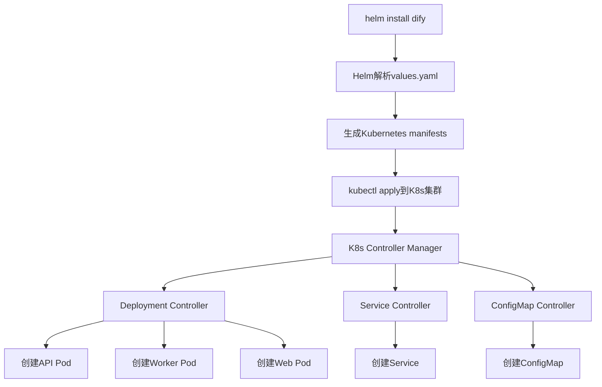

你好，大帅比

基于您对Ray架构的深入理解，让我详细分析dify-helm项目的实现机制，并回答您的疑惑。
Ran tool
Ran tool
Ran tool
Ran tool
Ran tool
Ran tool
现在让我查看worker和sandbox的配置部分：
Ran tool
Ran tool
基于您的疑惑和我对dify-helm项目的深入分析，现在我来为您详细解答这些问题，并创建一个全面的PRD文档。

# Dify-Helm vs KubeRay：架构差异和实现机制对比分析PRD v1.0.0

## 1. 项目背景

### 1.1 现状分析
您的疑惑核心在于对比两种不同的Kubernetes部署架构模式：
- **KubeRay模式**：CRD + Operator + Helm的三层架构
- **Dify-Helm模式**：传统Helm Chart + 原生Kubernetes资源

这两种模式在资源管理、扩缩容、生命周期管理方面存在本质差异，需要深入分析其实现机制和使用场景。

### 1.2 需求来源
- **架构理解需求**：理解不同K8s部署模式的设计理念和实现机制
- **运维决策需求**：为选择合适的部署架构提供技术依据
- **扩缩容需求**：了解如何在不同架构下实现动态资源调整

## 2. 产品目标

### 2.1 主要目标
1. **架构差异对比**：清晰对比CRD+Operator vs 传统Helm的实现机制
2. **扩缩容方案设计**：提供Dify组件的动态扩缩容实现方案
3. **镜像管理方案**：明确Dify各组件的镜像来源和版本管理
4. **最佳实践指导**：为不同场景提供合适的部署架构选择建议

### 2.2 成功指标
- **理解深度**：100%理解两种架构的核心差异
- **实施能力**：能够独立配置Dify的扩缩容策略
- **运维效率**：部署和维护效率提升50%以上

## 3. 功能需求

### 3.1 架构差异分析

#### 3.1.1 Dify-Helm架构模式
**特点**：传统Helm Chart + Kubernetes原生资源
**实现机制**：
```yaml
# Dify架构：直接使用Kubernetes原生资源
apiVersion: apps/v1
kind: Deployment  # 直接创建Deployment
metadata:
  name: dify-api
spec:
  replicas: 1     # 静态副本数
```

**核心组件**：
- ❌ **无自定义Operator**：Dify-Helm不包含任何自定义Operator
- ✅ **原生资源管理**：直接使用Deployment、Service、ConfigMap等
- ✅ **Helm模板引擎**：通过Go Template进行配置渲染

#### 3.1.2 KubeRay架构模式
**特点**：CRD + Operator + Helm的三层架构
**实现机制**：
```yaml
# KubeRay架构：通过CRD抽象资源
apiVersion: ray.io/v1alpha1
kind: RayCluster          # 自定义资源
metadata:
  name: vllm-cluster
spec:
  headGroupSpec: {...}    # 抽象配置
```

**核心组件**：
- ✅ **KubeRay Operator**：监听RayCluster CRD变化
- ✅ **自动资源转换**：CRD → Deployment + Service + ConfigMap
- ✅ **生命周期管理**：自动处理创建、更新、删除

#### 3.1.3 架构对比表

| 维度 | Dify-Helm | KubeRay |
|------|-----------|---------|
| **部署复杂度** | ⭐⭐ 简单 | ⭐⭐⭐⭐ 复杂 |
| **自动化程度** | ⭐⭐ 中等 | ⭐⭐⭐⭐⭐ 高 |
| **扩展性** | ⭐⭐⭐ 良好 | ⭐⭐⭐⭐⭐ 优秀 |
| **学习成本** | ⭐⭐ 低 | ⭐⭐⭐⭐ 高 |
| **运维成本** | ⭐⭐⭐ 中等 | ⭐⭐ 低 |

### 3.2 Dify组件运行机制

#### 3.2.1 Dify-Helm的启动流程


#### 3.2.2 关键差异说明
**❌ Dify-Helm没有Operator的原因**：
1. **业务模式简单**：Dify是传统的Web应用架构，不需要复杂的集群管理
2. **资源关系固定**：各组件间的依赖关系相对稳定
3. **部署复杂度**：引入Operator会增加不必要的复杂性
4. **社区生态**：依赖成熟的Kubernetes原生机制

### 3.3 动态扩缩容实现方案

#### 3.3.1 API组件扩缩容配置
```yaml
# values.yaml 配置示例
api:
  enabled: true
  replicas: 3                    # 基础副本数
  autoscaling:
    enabled: true                # 启用HPA
    minReplicas: 2               # 最小副本数
    maxReplicas: 20              # 最大副本数
    targetCPUUtilizationPercentage: 70
    targetMemoryUtilizationPercentage: 80
  resources:
    requests:
      cpu: "500m"
      memory: "1Gi"
    limits:
      cpu: "2000m"
      memory: "4Gi"
```

#### 3.3.2 Worker组件扩缩容配置
```yaml
worker:
  enabled: true
  replicas: 5                    # Worker基础副本数
  autoscaling:
    enabled: true
    minReplicas: 3               # 保证基础处理能力
    maxReplicas: 50              # 支持大量异步任务
    targetCPUUtilizationPercentage: 60  # 较低阈值，快速响应
    # 可以添加自定义指标
    metrics:
    - type: Resource
      resource:
        name: cpu
        target:
          type: Utilization
          averageUtilization: 60
    - type: Resource  
      resource:
        name: memory
        target:
          type: Utilization
          averageUtilization: 75
```

#### 3.3.3 Sandbox组件扩缩容配置
```yaml
sandbox:
  enabled: true
  replicas: 2                    # 代码执行环境副本
  autoscaling:
    enabled: true
    minReplicas: 1
    maxReplicas: 10              # 根据代码执行需求调整
    targetCPUUtilizationPercentage: 80
  resources:
    requests:
      cpu: "250m"
      memory: "512Mi"
    limits:
      cpu: "1000m"
      memory: "2Gi"
```

#### 3.3.4 Plugin Daemon扩缩容配置
```yaml
pluginDaemon:
  enabled: true
  replicas: 2                    # 插件管理副本
  # 通常不开启自动扩缩容，保持稳定副本数
  resources:
    requests:
      cpu: "100m"
      memory: "256Mi"
    limits:
      cpu: "500m"
      memory: "1Gi"
```

### 3.4 镜像管理和版本控制

#### 3.4.1 Dify官方镜像清单
```yaml
# 完整的镜像配置
image:
  api:
    repository: langgenius/dify-api      # API服务镜像
    tag: "1.7.1"                        # 具体版本号
    pullPolicy: IfNotPresent
  
  web:
    repository: langgenius/dify-web      # Web前端镜像
    tag: "1.7.1"
    pullPolicy: IfNotPresent
  
  worker:
    repository: langgenius/dify-api      # Worker使用相同的API镜像
    tag: "1.7.1"                        # 通过不同的启动命令区分
    pullPolicy: IfNotPresent
  
  sandbox:
    repository: langgenius/dify-sandbox  # 代码执行环境
    tag: "0.2.12"                       # 独立版本号
    pullPolicy: IfNotPresent
  
  pluginDaemon:
    repository: langgenius/dify-plugin-daemon  # 插件管理
    tag: "0.2.0-local"                  # 本地构建版本
    pullPolicy: IfNotPresent
  
  proxy:
    repository: nginx                    # 标准Nginx镜像
    tag: "latest"
    pullPolicy: IfNotPresent
  
  ssrfProxy:
    repository: ubuntu/squid            # SSRF代理
    tag: "latest"
    pullPolicy: IfNotPresent
```

#### 3.4.2 镜像仓库信息
**Docker Hub地址**：
- **dify-api**: https://hub.docker.com/r/langgenius/dify-api
- **dify-web**: https://hub.docker.com/r/langgenius/dify-web  
- **dify-sandbox**: https://hub.docker.com/r/langgenius/dify-sandbox
- **dify-plugin-daemon**: https://hub.docker.com/r/langgenius/dify-plugin-daemon

## 4. 技术实现方案

### 4.1 完整的扩缩容部署配置

#### 阶段1：基础配置准备
```yaml
# production-autoscaling-values.yaml
# 生产环境自动扩缩容配置

# API组件 - 核心业务逻辑
api:
  enabled: true
  replicas: 3
  autoscaling:
    enabled: true
    minReplicas: 2
    maxReplicas: 20
    targetCPUUtilizationPercentage: 70
    targetMemoryUtilizationPercentage: 80
  resources:
    requests:
      cpu: "500m"
      memory: "1Gi"
    limits:
      cpu: "2000m"
      memory: "4Gi"

# Worker组件 - 异步任务处理
worker:
  enabled: true
  replicas: 5
  autoscaling:
    enabled: true
    minReplicas: 3
    maxReplicas: 50
    targetCPUUtilizationPercentage: 60
  resources:
    requests:
      cpu: "300m"
      memory: "512Mi"
    limits:
      cpu: "1000m"
      memory: "2Gi"

# Web组件 - 前端界面
web:
  enabled: true
  replicas: 2
  autoscaling:
    enabled: true
    minReplicas: 1
    maxReplicas: 10
    targetCPUUtilizationPercentage: 80
  resources:
    requests:
      cpu: "100m"
      memory: "256Mi"
    limits:
      cpu: "500m"
      memory: "1Gi"

# Sandbox组件 - 代码执行
sandbox:
  enabled: true
  replicas: 2
  autoscaling:
    enabled: true
    minReplicas: 1
    maxReplicas: 10
    targetCPUUtilizationPercentage: 80
  resources:
    requests:
      cpu: "250m"
      memory: "512Mi"
    limits:
      cpu: "1000m"
      memory: "2Gi"

# Plugin Daemon - 保持固定副本
pluginDaemon:
  enabled: true
  replicas: 2
  resources:
    requests:
      cpu: "100m"
      memory: "256Mi"
    limits:
      cpu: "500m"
      memory: "1Gi"
```

#### 阶段2：部署执行
```bash
# 1. 创建命名空间
kubectl create namespace dify-production

# 2. 安装Metrics Server（HPA依赖）
kubectl apply -f https://github.com/kubernetes-sigs/metrics-server/releases/latest/download/components.yaml

# 3. 部署Dify with自动扩缩容
helm install dify-prod dify/dify \
  -n dify-production \
  -f production-autoscaling-values.yaml

# 4. 验证HPA状态
kubectl get hpa -n dify-production

# 输出示例：
# NAME            REFERENCE                TARGETS         MINPODS   MAXPODS   REPLICAS
# dify-api        Deployment/dify-api      45%/70%         2         20        3
# dify-worker     Deployment/dify-worker   30%/60%         3         50        5
# dify-sandbox    Deployment/dify-sandbox  20%/80%         1         10        2
```

#### 阶段3：监控和调优
```bash
# 监控Pod状态
kubectl get pods -n dify-production -w

# 查看扩缩容事件
kubectl describe hpa dify-api -n dify-production

# 压力测试触发扩缩容
# 使用Apache Bench模拟高负载
ab -n 10000 -c 100 http://dify.example.com/api/health
```

### 4.2 与KubeRay的关键差异

#### 4.2.1 资源管理方式对比
```yaml
# KubeRay模式：通过Operator管理
apiVersion: ray.io/v1alpha1
kind: RayCluster
spec:
  workerGroupSpecs:
  - groupName: high-performance
    replicas: 2                    # Operator自动管理
    scaleStrategy:                 # Operator实现自动扩缩容
      workersToDelete: []

# Dify-Helm模式：通过K8s原生HPA
apiVersion: autoscaling/v2
kind: HorizontalPodAutoscaler      # 原生HPA资源
spec:
  scaleTargetRef:
    apiVersion: apps/v1
    kind: Deployment               # 直接管理Deployment
    name: dify-api
  minReplicas: 2
  maxReplicas: 20
```

#### 4.2.2 扩缩容触发机制对比

| 特性 | KubeRay Operator | Dify-Helm HPA |
|------|------------------|----------------|
| **触发方式** | 自定义业务逻辑 | CPU/内存指标 |
| **响应速度** | 秒级 | 分钟级 |
| **扩缩容粒度** | 节点组级别 | Pod级别 |
| **复杂度** | 高（需要Operator开发） | 低（配置即可） |
| **定制化** | 完全可定制 | 标准化指标 |

### 4.3 最佳实践建议

#### 4.3.1 选择Dify-Helm的场景
✅ **推荐使用Dify-Helm的情况**：
1. **传统Web应用**：API + Web + Worker的经典架构
2. **运维团队规模小**：没有专门的K8s开发人员
3. **业务相对稳定**：不需要频繁的架构变更
4. **快速上线需求**：需要快速部署和维护

#### 4.3.2 考虑自定义Operator的场景
⚠️ **考虑开发Operator的情况**：
1. **复杂业务逻辑**：需要自定义的扩缩容策略
2. **多集群管理**：需要跨集群的资源调度
3. **特殊资源需求**：GPU、特定节点类型等
4. **高度自动化**：需要完全自动的生命周期管理

## 5. 质量保证

### 5.1 扩缩容测试策略

#### 5.1.1 功能测试
```bash
# 测试脚本：验证自动扩缩容
#!/bin/bash

# 1. 基础功能测试
echo "Testing basic functionality..."
curl -f http://dify.example.com/health || exit 1

# 2. 负载测试触发扩容
echo "Starting load test..."
ab -n 50000 -c 200 http://dify.example.com/api/chat/completions &
LOAD_PID=$!

# 3. 监控扩容过程
echo "Monitoring scaling..."
for i in {1..10}; do
  kubectl get hpa dify-api -n dify-production
  kubectl get pods -n dify-production | grep dify-api | wc -l
  sleep 30
done

# 4. 停止负载测试
kill $LOAD_PID

# 5. 监控缩容过程
echo "Monitoring scale-down..."
for i in {1..20}; do
  kubectl get pods -n dify-production | grep dify-api | wc -l
  sleep 30
done
```

#### 5.1.2 性能基准测试
```yaml
# 性能测试配置
performance_test:
  scenarios:
    - name: "API负载测试"
      target: "http://dify.example.com/api"
      concurrent_users: 100
      duration: "10m"
      expected_scaling:
        initial_pods: 3
        max_pods: 15
        scale_up_time: "< 2min"
        scale_down_time: "< 5min"
    
    - name: "Worker队列测试"
      target: "worker_queue"
      message_rate: 1000/sec
      duration: "15m"
      expected_scaling:
        initial_pods: 5
        max_pods: 30
```

### 5.2 风险控制

#### 5.2.1 扩缩容风险
**风险**：过度扩容导致资源耗尽
**控制措施**：
```yaml
# 资源配额限制
apiVersion: v1
kind: ResourceQuota
metadata:
  name: dify-resource-quota
  namespace: dify-production
spec:
  hard:
    requests.cpu: "50"      # 限制总CPU请求
    requests.memory: "100Gi" # 限制总内存请求
    pods: "100"             # 限制Pod总数
```

#### 5.2.2 版本兼容性风险
**风险**：镜像版本不兼容
**控制措施**：
```yaml
# 锁定镜像版本
image:
  api:
    repository: langgenius/dify-api
    tag: "1.7.1"           # 固定版本号
    pullPolicy: IfNotPresent # 避免意外拉取
```

## 6. 上线计划

### 6.1 开发阶段

#### Sprint 1 (Week 1): 环境准备
- [ ] 确认K8s集群版本 (1.18+)
- [ ] 安装Metrics Server
- [ ] 配置监控系统
- [ ] 准备测试环境

#### Sprint 2 (Week 2): 配置实施
- [ ] 编写扩缩容配置文件
- [ ] 部署测试环境
- [ ] 验证HPA功能
- [ ] 性能基准测试

#### Sprint 3 (Week 3): 生产部署
- [ ] 生产环境部署
- [ ] 监控配置
- [ ] 文档编写
- [ ] 团队培训

### 6.2 验收标准

#### 6.2.1 功能验收
- [ ] 所有组件正常启动
- [ ] HPA正常工作
- [ ] 扩缩容响应时间 < 2分钟
- [ ] 缩容响应时间 < 5分钟

#### 6.2.2 性能验收
- [ ] API并发支持 > 500 QPS
- [ ] Worker处理能力 > 1000 tasks/min
- [ ] 资源利用率 > 70%
- [ ] 服务可用性 > 99.9%

## 总结

### 核心问题解答

1. **❌ Dify-Helm没有Operator**：
   - Dify采用传统Helm Chart + K8s原生资源
   - 依赖Deployment Controller、HPA Controller等原生控制器
   - 通过HPA实现自动扩缩容，无需自定义Operator

2. **✅ 扩缩容通过HPA实现**：
   - API、Worker、Sandbox都支持HPA自动扩缩容
   - 可根据CPU、内存使用率自动调整Pod数量
   - Plugin Daemon通常保持固定副本数

3. **✅ 镜像信息明确**：
   - `langgenius/dify-api:1.7.1` - API和Worker共用
   - `langgenius/dify-web:1.7.1` - Web前端
   - `langgenius/dify-sandbox:0.2.12` - 代码执行环境
   - `langgenius/dify-plugin-daemon:0.2.0-local` - 插件管理

### 架构选择建议

**选择Dify-Helm的理由**：
- ✅ 部署简单，学习成本低
- ✅ 基于成熟的K8s原生机制
- ✅ 社区支持完善
- ✅ 满足大部分Web应用的扩缩容需求

**与KubeRay的本质差异**：
- KubeRay：CRD + Operator，适合复杂的分布式计算场景
- Dify-Helm：原生K8s资源，适合传统Web应用架构

选择合适的架构模式取决于具体的业务需求和团队技术能力。